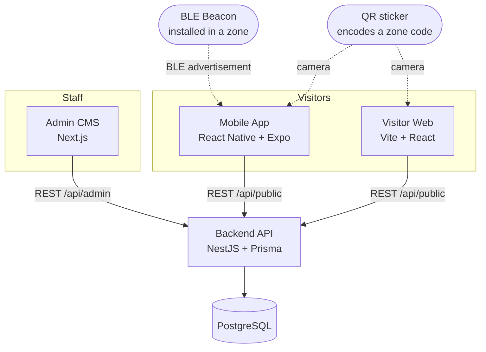

# Smart Multilingual Museum Guide — BLE Beacons with QR Fallback

A working museum guide platform: BLE beacons tell a visitor's phone **which zone**
they are standing in, the backend resolves **which exhibit is in that zone right
now**, and the content is delivered in the visitor's language with narration
audio. QR codes cover everyone who does not install the app.

The architectural point of the project: **beacons and QR codes identify a _place_,
never an _object_.** Rotating an exhibition is a data change in the CMS — no beacon
is re-flashed, no QR sticker is reprinted.

```
BLE beacon ─┐        (Eddystone UID: namespace:instance)
            ├─► zone ─► current assignment ─► exhibit ─► translation + audio
QR code  ───┘        (/q/ZONE_A01)
```

Staff never fill in a date: the CMS asks *what is in this room?* and keeps the
dated assignment underneath, which is what preserves both the fixed hardware and
the record of what stood where.

---

## 1. Applications

| App | Stack | Purpose |
| --- | --- | --- |
| `apps/api` | NestJS · TypeScript · Prisma · PostgreSQL | Source of truth. Content, scheduling, BLE/QR resolution. |
| `apps/admin` | Next.js · TypeScript · Tailwind · shadcn/ui | Museum staff CMS: zones, beacons, exhibits, translations, media. |
| `apps/mobile` | React Native · Expo · TypeScript · `react-native-ble-plx` | Visitor app. Scans beacons, detects the zone on-device, plays narration. |
| `apps/visitor-web` | Vite · React · TypeScript · Tailwind | QR landing page. No app, no account. |

Further reading:

- [`docs/architecture.md`](docs/architecture.md) — components, data flow, design decisions
- [`docs/database.md`](docs/database.md) — entities, relationships, how "what is in this room" is stored
- [`docs/ble-detection.md`](docs/ble-detection.md) — why raw RSSI is unusable and what the app does about it
- [`docs/hardware.md`](docs/hardware.md) — Minew i3, Eddystone vs iBeacon, Tx power and calibration
- [`docs/demo-guide.md`](docs/demo-guide.md) — click-by-click demonstration script

---

## 2. Architecture at a glance



**Critical rule:** the phone does all RSSI work locally and only ever asks the
backend *"what is active for this beacon / zone?"*. Raw signal streams, movement
histories and device identifiers are never uploaded.

---

## 3. Prerequisites

- **Node.js 20+** and npm 10+ (`node -v`)
- **PostgreSQL 14+** installed locally — no Docker required
- For the mobile app: **Expo CLI via npx**, plus Android Studio or Xcode if you
  want to build the development client yourself
- A phone on the **same Wi-Fi network** as your laptop (for real device testing)

### PostgreSQL setup

macOS (Homebrew):

```bash
brew install postgresql@16
brew services start postgresql@16
createdb smart_museum_guide
```

Ubuntu / Debian:

```bash
sudo apt install postgresql
sudo service postgresql start
sudo -u postgres psql -c "ALTER USER postgres PASSWORD 'postgres';"
sudo -u postgres createdb smart_museum_guide
```

Windows: install from postgresql.org, then create the `smart_museum_guide`
database with pgAdmin.

---

## 4. Installation

```bash
git clone <your-repo-url> smart-museum-guide
cd smart-museum-guide
npm install          # installs api + admin + visitor-web, then apps/mobile
```

`apps/mobile` is intentionally **not** an npm workspace member: Metro (the React
Native bundler) resolves modules from `apps/mobile/node_modules`, and hoisting
breaks it. The root `postinstall` script installs it for you.

### Environment files

Every app ships an `.env.example`. Copy each one:

```bash
cp apps/api/.env.example          apps/api/.env
cp apps/admin/.env.example        apps/admin/.env.local
cp apps/visitor-web/.env.example  apps/visitor-web/.env
cp apps/mobile/.env.example       apps/mobile/.env
```

| File | Key values |
| --- | --- |
| `apps/api/.env` | `DATABASE_URL`, `JWT_SECRET`, `PORT=3001`, `DEFAULT_LANGUAGE`, `SUPPORTED_LANGUAGES` |
| `apps/admin/.env.local` | `NEXT_PUBLIC_API_URL=http://localhost:3001/api` |
| `apps/visitor-web/.env` | `VITE_API_URL=http://localhost:3001/api` |
| `apps/mobile/.env` | `EXPO_PUBLIC_API_URL=http://<your-LAN-IP>:3001/api`, `EXPO_PUBLIC_BLE_SIMULATION` |

> **A phone cannot reach `localhost`.** Put your laptop's LAN address in
> `EXPO_PUBLIC_API_URL` (e.g. `http://192.168.1.20:3001/api`). Find it with
> `ipconfig getifaddr en0` (macOS) or `hostname -I` (Linux).

Set a real `JWT_SECRET` before doing anything beyond local development.

---

## 5. Database

```bash
npm run db:migrate      # create the schema (Prisma migrations)
npm run db:seed         # demo museum: 3 zones, 3 Minew i3 beacons, 5 exhibits
```

Useful extras:

```bash
npm run db:reset        # drop, re-migrate and re-seed
npm run db:studio       # Prisma Studio, a GUI over the data
```

The seed builds its dates relative to *today*, so every zone has a live exhibit
and `ZONE_A01` also carries one closed assignment — enough to show both the
current state and the display history the moment you install.

---

## 6. Running everything

Four terminals (or four tabs):

```bash
npm run dev:api      # http://localhost:3001/api
npm run dev:admin    # http://localhost:3000
npm run dev:web      # http://localhost:5173
npm run dev:mobile   # Expo dev server
```

Quick check that the API is alive:

```bash
curl http://localhost:3001/api/health
curl "http://localhost:3001/api/public/zones/ZONE_A01/active-exhibit?lang=en"
```

### Demo credentials

```
http://localhost:3000/login
admin@museum.local  /  Admin@12345
```

Both values come from `SEED_ADMIN_EMAIL` / `SEED_ADMIN_PASSWORD` in
`apps/api/.env`. Change them and re-seed for anything but a local demo.

---

## 7. The mobile app

### 7.1 Simulation mode (no hardware needed)

```bash
# apps/mobile/.env
EXPO_PUBLIC_BLE_SIMULATION=true
```

```bash
npm run dev:mobile
```

Open the app → **Start tour** → **Enable Bluetooth and continue** →
**Settings ▸ BLE simulator**. Drag the signal levels and watch candidate
selection, dwell progress and zone confirmation happen live.

The simulator is **not** a separate fake flow: its signals pass through the same
sliding window, outlier rejection, smoothing, ranking, dwell timer, hysteresis
and cooldown as real hardware. See [`docs/ble-detection.md`](docs/ble-detection.md).

In simulation mode the app also runs inside plain Expo Go, which is convenient
for coursework demonstrations.

### 7.2 Real BLE — requires an Expo Development Build

`react-native-ble-plx` is a **native module**. It cannot load in the standard
Expo Go client. Build a development client once, then iterate normally:

```bash
cd apps/mobile

# Local build (needs Android Studio / Xcode)
npx expo prebuild
npx expo run:android          # or: npx expo run:ios

# …or a cloud build
npm install -g eas-cli
eas login
eas build --profile development --platform android
```

Then:

```bash
# apps/mobile/.env
EXPO_PUBLIC_BLE_SIMULATION=false
```

```bash
npm run dev:mobile            # starts with --dev-client
```

Android additionally needs the runtime *nearby devices* (and, below Android 12,
*location*) permission — the OS prompt is raised the first time a scan starts.
The permissions themselves are declared in `apps/mobile/app.json`.

### 7.3 Configuring real beacons

Reference hardware is the **Minew i3**, configured with the BeaconSET+ app.
Full detail — protocol choice, Tx power, advertising interval, calibration
procedure — is in [`docs/hardware.md`](docs/hardware.md). The short version:

1. In BeaconSET+, give every beacon the **same Eddystone namespace** (20 hex
   characters) and a **unique instance** (12 hex characters).
2. Set **Tx power to about −8 dBm** and the **advertising interval to ~500 ms**.
   Turning the power up is the most common mistake: a 200 m beacon makes museum
   zones overlap and detection unreliable.
3. Optionally also enable the iBeacon frame on the same unit and note its
   UUID/major/minor — it costs nothing and is the identity iOS Core Location
   would need for background detection later.
4. In the CMS: **Beacons ▸ New beacon** — identifier (e.g. `BEACON_A01`),
   protocol **Eddystone UID**, the namespace + instance, the zone, and the Tx
   power / interval you configured.

   The dialog has a **Scan** button that reads nearby beacons and fills the
   identity fields for you. Build the helper once:

   ```bash
   npm run scanner:build
   ```

   macOS only, and the scan runs on the machine hosting the API — that is
   where the radio is. macOS grants Bluetooth to the *app that launched the
   API*, so allow it for your terminal under **System Settings ▸ Privacy &
   Security ▸ Bluetooth** and start the API from that same app. If anything is
   missing the button says exactly what; the manual fields always work.
5. Restart the mobile app. It downloads `GET /api/public/beacons` on startup and
   matches advertisements locally: Eddystone service data `0xFEAA` first,
   iBeacon manufacturer data second. The BLE device id is never used — it is a
   MAC on Android and a per-installation UUID on iOS.
6. Walk the building and tune `EXPO_PUBLIC_DWELL_TIME_MS` and
   `EXPO_PUBLIC_HYSTERESIS_DB` (also adjustable live in **Settings**). These are
   building-specific calibration values, not universal constants.

> **Background detection is not implemented.** Zones are detected while the app
> is open. iOS throttles background BLE scanning enough to break the dwell logic;
> the dependable route is a Core Location native module. The seam exists at
> `src/features/ble/ios-region-monitor.ts`, reports itself as unavailable, and
> documents exactly what such a module would need.

## 8. Scripts

| Command | What it does |
| --- | --- |
| `npm run dev:api` / `dev:admin` / `dev:web` / `dev:mobile` | Start one app |
| `npm run build` | Production build of api + admin + visitor-web |
| `npm run test` | Backend Jest suite + mobile BLE algorithm suite |
| `npm run lint` | ESLint across all four apps |
| `npm run typecheck` | `tsc --noEmit` across all four apps |
| `npm run db:migrate` / `db:seed` / `db:reset` / `db:studio` | Prisma helpers |
| `npm run format` | Prettier |

---

## 9. Repository layout

```
smart-museum-guide/
├── apps/
│   ├── api/            NestJS backend  (auth, zones, beacons, exhibits,
│   │                   assignments, media, public-guide, dashboard)
│   │                   src/exhibits/exhibit-resolver.service.ts ← the one rule
│   ├── admin/          Next.js CMS
│   ├── mobile/         Expo app — src/features/ble holds the whole algorithm
│   └── visitor-web/    Vite QR landing app
└── docs/               architecture · database · ble-detection · demo-guide
```

---

## 10. Troubleshooting

**`Can't reach database server` / `P1001`**
PostgreSQL is not running, or `DATABASE_URL` is wrong. Check with
`psql "$DATABASE_URL" -c 'select 1'`.

**Admin shows "Cannot reach the API"**
The API is not on `http://localhost:3001`, or `NEXT_PUBLIC_API_URL` is missing
the `/api` suffix. Next.js only reads `.env.local` at server start — restart it.

**Mobile shows "Cannot reach the museum server"**
`EXPO_PUBLIC_API_URL` still says `localhost`. Use the LAN IP, make sure the phone
is on the same network, and that your firewall allows port 3001. Expo only reads
`EXPO_PUBLIC_*` at bundler start — restart with `npx expo start -c`.

**`BleManager` is undefined / native module missing**
You are running in Expo Go with `EXPO_PUBLIC_BLE_SIMULATION=false`. Either build
a development client (§7.2) or switch simulation back on.

**No beacon is ever detected on Android**
Nearby-devices permission denied, or (Android ≤ 11) location services are off —
Android refuses BLE scan results when location is disabled.

**The app keeps flipping between two zones**
Raise `EXPO_PUBLIC_HYSTERESIS_DB` and/or `EXPO_PUBLIC_DWELL_TIME_MS`. Both are
tunable live in **Settings**.

**`BEACON_IDENTITY_INVALID` when saving a beacon**
An Eddystone UID beacon needs both a namespace (20 hex characters) and an
instance (12 hex characters); an iBeacon needs UUID + major + minor. A beacon the
phone cannot recognise from the air is not saved.

**Visitor web shows "Nothing on display here right now"**
The zone has no current exhibit, or the one it has is still `DRAFT`. Open the
zone in the CMS and set one — the dashboard highlights zones in this state.

**A beacon is registered but never detected**
Check that the namespace/instance in the CMS match BeaconSET+ exactly (case does
not matter, length does), and that the beacon is `enabled`. On Android also
confirm the nearby-devices permission; on Android ≤ 11, location services must be
on or the OS withholds BLE scan results.

---

## 11. Privacy

Visitors have no account and are never identified. RSSI collection, smoothing and
zone detection happen entirely on the phone; the only thing sent to the backend is
a beacon identifier or zone code when a zone is *confirmed*. No RSSI history, no
movement trace, no device identifier, no analytics. This is a content delivery
system, not a tracking system.

## 12. Scope note — RFID

RFID is a valid academic alternative for identification, but it is deliberately
**not** implemented here: no readers, no APIs, no database models. The system uses
BLE for automatic proximity detection and QR for manual fallback. RFID is listed
only as possible future work.
# smart-museum-guide
