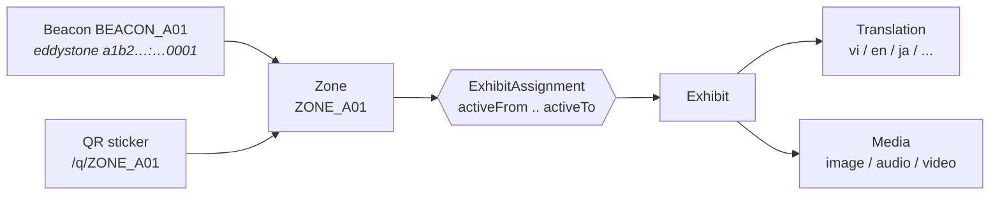
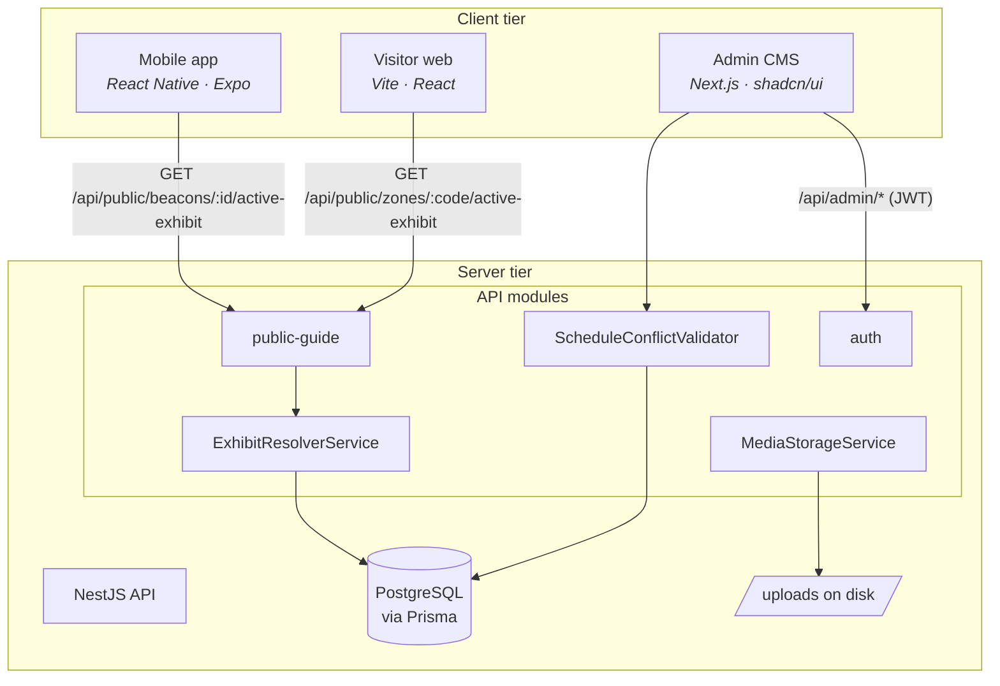
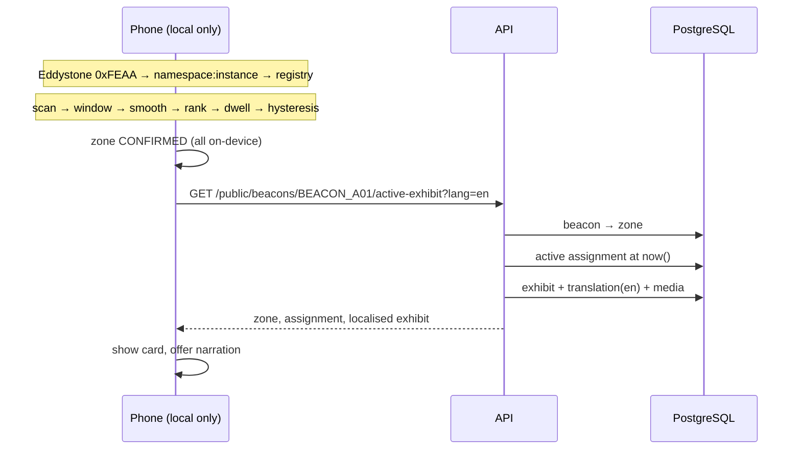
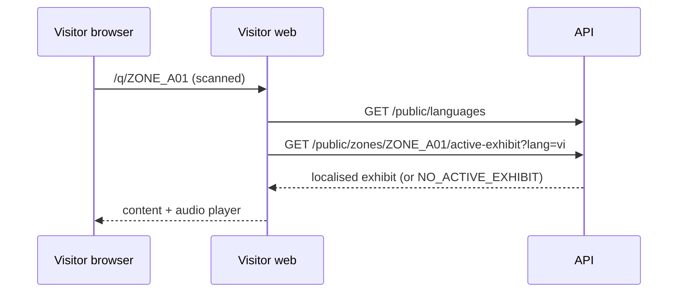

# Architecture

## 1. The problem this shape solves

A museum guide has two moving parts that change at completely different speeds:

| Changes rarely | Changes often |
| --- | --- |
| Where the rooms are | Which object is in a room |
| Where beacons are screwed to the wall | Which language a visitor wants |
| Which QR sticker is printed next to a door | Which narration file is current |

A naive design binds a beacon (or a QR code) directly to an exhibit. The moment
the museum rotates an exhibition, every sticker has to be reprinted and every
beacon reconfigured. That is the failure mode this architecture exists to avoid.

**Beacons and QR codes identify a place. A time-based assignment says what is in
that place.**



## 2. Components



### Backend module map

```
apps/api/src/
├── auth/            JWT login for museum staff (visitors never authenticate)
├── zones/           Zone CRUD + QR payload/PNG generation
├── beacons/         Beacon CRUD, enable/disable, zone assignment
├── exhibits/        Exhibit CRUD, translations, media
│   ├── exhibit-resolver.service.ts   ← the scheduling rule, used by everything
│   └── exhibit-content.service.ts    ← language selection + fallback
├── assignments/     Zone ↔ exhibit over time (no CRUD screen; see below)
│   ├── current-exhibit.planner.ts     ← pure "what has to change" decision
│   └── schedule-conflict.validator.ts ← one-exhibit-per-zone invariant
├── media/           MediaStorageService abstraction + local disk implementation
├── public-guide/    The only visitor-facing controller
├── dashboard/       Aggregated "what is live right now" view for staff
├── common/          Error codes, exception filter, pagination, date helpers
├── config/          Zod-validated environment
└── prisma/          PrismaService
```

## 3. The one rule, in one place

`ExhibitResolverService.resolveActiveExhibit(zoneId, at)` is the **single**
implementation of "what is on display here right now":

```
activeFrom <= at  AND  (activeTo IS NULL OR at < activeTo)
```

Half-open intervals `[activeFrom, activeTo)` mean an entry ending on 1 September
and the next one starting on 1 September do not overlap, and there is never an
instant where two exhibits are both current.

Every caller goes through it:

| Caller | Path |
| --- | --- |
| Mobile (BLE) | beacon identifier → zone → resolver |
| Visitor web (QR) | zone code → zone → resolver |
| Mobile QR fallback | zone code → zone → resolver |
| CMS dashboard | zone → resolver (with `requirePublished: false`) |
| CMS zone detail | zone → resolver + display history |

Controllers stay thin; nobody re-implements the predicate. The pure part,
`selectActiveAssignment(assignments, at)`, is exported separately so it can be
unit-tested with no database at all.

## 4. Request flows

### BLE



The phone contacts the server **once per confirmed zone**, not once per
advertisement. A visitor standing still generates zero traffic.

### QR



## 5. Design decisions

**Eddystone UID as the primary identity, iBeacon as the secondary.**
Eddystone travels in BLE service data, which Android and iOS both hand to an
ordinary scan, so one `react-native-ble-plx` code path serves both platforms.
iBeacon on iOS is routed through Core Location instead, which would have made a
Core Bluetooth binding behave differently per platform — discovered late, on an
iPhone. The iBeacon frame is still configured and stored because it is what iOS
background region monitoring needs. The BLE device id is never used as identity:
it is a MAC on Android and a per-installation UUID on iOS. Details in
[`hardware.md`](hardware.md).

**Signal processing on the device, not the server.**
Uploading an RSSI stream would mean a continuous connection per visitor, a
tracking database, and worse latency than the phone can achieve locally. The
backend answers a question; it does not observe visitors.

**A shared `BeaconSignalSource` interface.**
`RealBleSignalSource` and `SimulatedBleSignalSource` implement the same
interface, so the detector cannot tell them apart. The simulator therefore
exercises the *real* algorithm rather than a parallel mock path.

**Storage behind an abstraction.**
`MediaStorageService` is an abstract class; `LocalMediaStorageService` writes to
`apps/api/uploads`. Swapping in S3 later is a one-line provider change in
`MediaModule` — no controller or service changes.

**Machine readable error codes.**
Every non-2xx response carries `{ statusCode, code, message, details?, path,
timestamp }`. Clients branch on `code` (`NO_ACTIVE_EXHIBIT`, `ZONE_NOT_FOUND`,
`SCHEDULE_OVERLAP`, …) instead of parsing prose, which is what lets the mobile
app and the visitor web render sensible empty states in six languages.

**Staff pick a room's contents; the service keeps the dates.**
There is no scheduling screen. The CMS asks "what is in this room?" and
`planCurrentExhibitChange()` — a pure function — decides what to close, delete
and create. `ScheduleConflictValidator` then asserts the invariant that a zone
resolves to exactly one exhibit. The UI cannot express an overlap any more, and
the database still refuses one.

**Languages are data.**
Adding Korean is inserting an `ExhibitTranslation` row. No enum, no migration,
no deployment. `SUPPORTED_LANGUAGES` in the API env controls what the pickers
offer; the fallback chain (`requested → base language → default → first
available`) keeps the app usable while translations are still being written.

## 6. What deliberately is not here

- **No Docker / Kubernetes / microservices.** One Nest process, one Postgres, one
  npm install. A student must be able to run this on a laptop.
- **No RFID.** BLE covers automatic proximity; QR covers manual access.
  RFID is future work, not scope.
- **No visitor analytics.** There is no table that could hold a visitor trace.
- **No background zone entry.** iOS throttles background BLE badly enough to
  break the dwell logic; the honest route is a Core Location native module. The
  seam is defined in `ios-region-monitor.ts` and reported as unavailable rather
  than faked.
- **No machine learning.** A sliding window with median/weighted smoothing solves
  the RSSI problem at a fraction of the complexity, and can be explained in a
  viva.
