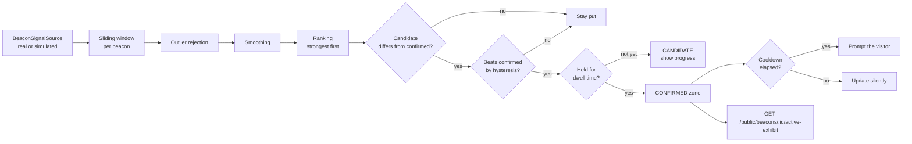
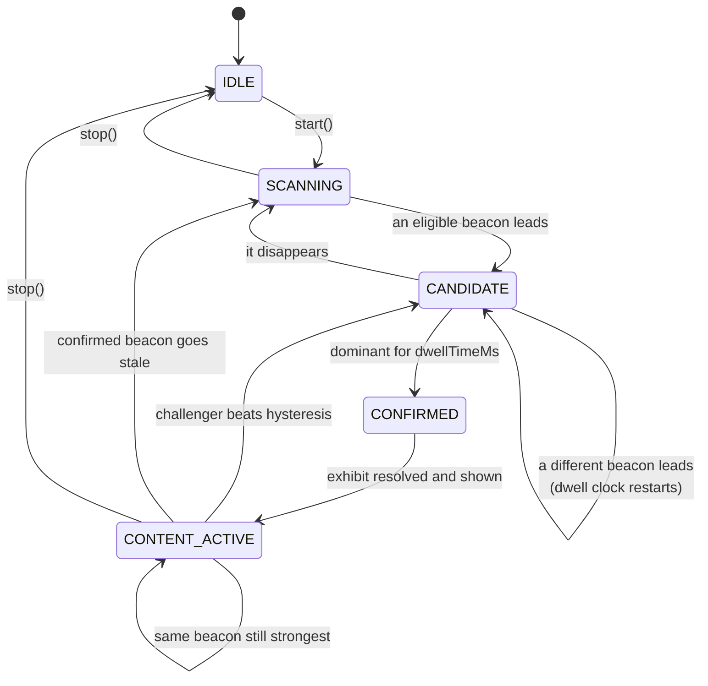
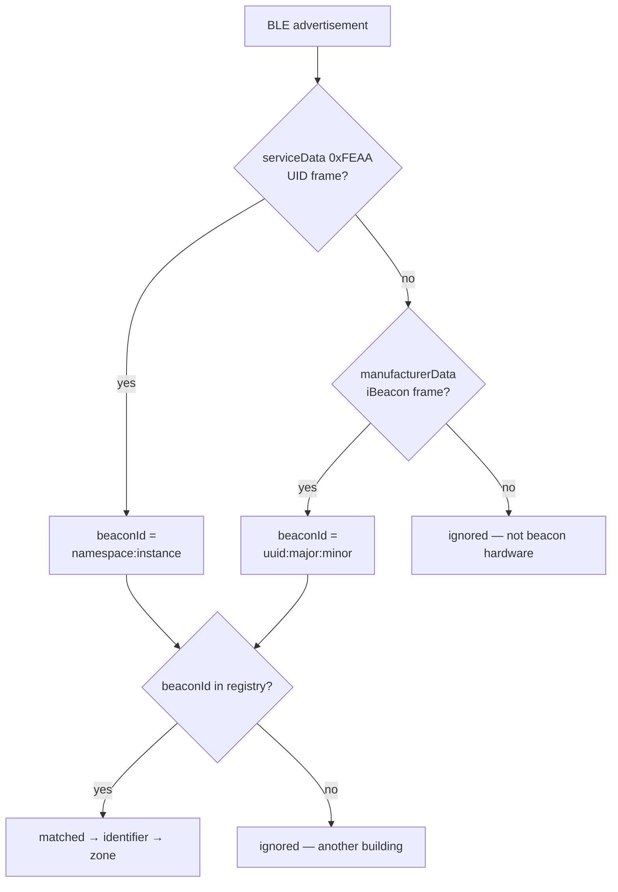

# BLE zone detection

Everything described here lives in [`apps/mobile/src/features/ble/`](../apps/mobile/src/features/ble)
and runs **entirely on the visitor's phone**. The backend is asked one question,
once, per confirmed zone.

```
src/features/ble/
├── types.ts                    BeaconSignal, BeaconSignalSource, DetectionSnapshot
├── eddystone.ts                Eddystone UID frame parsing (service data 0xFEAA)
├── ibeacon.ts                  base64 + iBeacon frame parsing
├── advertisement.ts            one advertisement → { protocol, beaconId, txPower }
├── beacon-registry.ts          beaconId → registered beacon → zone
├── signal-processor.ts         sliding window · outliers · smoothing
├── zone-detector.ts            candidate · dwell · hysteresis · cooldown · state machine
├── scanner.ts                  wires source → processor → detector → UI
├── ios-region-monitor.ts       background seam (documented, not implemented)
└── sources/
    ├── real-ble-source.ts      react-native-ble-plx
    └── simulated-ble-source.ts developer mode
```

Hardware selection, Tx power and advertising interval live in
[`hardware.md`](hardware.md).

---

## 1. Why raw RSSI cannot be trusted

RSSI (Received Signal Strength Indicator, in dBm) is the only distance-ish
quantity a phone gets from a BLE advertisement, and it is *noisy*:

- **Multipath.** Signals bounce off marble floors, glass cases and metal frames.
  Two readings 100 ms apart can differ by 10–15 dB without anyone moving.
- **Body absorption.** The human body attenuates 2.4 GHz badly. Putting the phone
  in the other hand can cost 10 dB. A group of visitors walking between you and
  the beacon looks exactly like the beacon suddenly moving away.
- **Antenna and chipset variation.** Two phone models report different RSSI for
  the same beacon at the same distance. Absolute values are not portable.
- **Advertising jitter.** Beacons randomise their advertising interval, so the
  sample rate is uneven.
- **Non-monotonic in space.** RSSI does not decrease smoothly with distance;
  it plateaus, spikes and dips.

A naive implementation — *"take the strongest RSSI reading and switch to that
zone"* — produces a guide that flickers between rooms while the visitor stands
perfectly still. That is unusable, and it is exactly what the pipeline below
prevents.

---

## 2. The pipeline



### 2.1 Sliding window

`SignalProcessor` keeps the last `scanWindowMs` (default **4000 ms**) of readings
per beacon, capped at 25 samples. Anything older is discarded on every pass; a
beacon unheard for `staleAfterMs` (8 s) is forgotten completely.

```
BEACON_A01  [-68, -69, -65, -90, -67]
BEACON_A02  [-84, -86, -85]
```

Four seconds is a compromise: long enough to average out multipath, short enough
that the guide still reacts while a visitor is walking.

### 2.2 Outlier rejection

Samples further than `outlierThresholdDb` (default **12 dB**) from the window
**median** are dropped before smoothing. In the window above, `-90` goes.

The median is used as the centre rather than the mean, precisely because the mean
is dragged by the spike we are trying to remove. Two guards keep it safe:

- fewer than 3 samples → nothing is dropped (nothing meaningful to compare to)
- if *every* sample looks like an outlier → nothing is dropped, because that means
  the threshold is mis-calibrated for this environment, not that the data is bad

### 2.3 Smoothing

The surviving samples collapse to one comparable number. Three strategies ship;
`weighted` is the default:

| Strategy | Behaviour |
| --- | --- |
| `median` | Most robust, slowest to react |
| `mean` | Simple, still sensitive to what survived filtering |
| `weighted` | Weighted moving average, weights `1,2,3,…` oldest→newest |

The weighted average deliberately favours recent samples so a visitor who has
genuinely walked into the next room is not held back by four-second-old history.
No machine learning is involved, and none is needed.

### 2.4 Ranking and eligibility

Beacons are sorted by smoothed RSSI, strongest first. A beacon is only eligible
if it:

- has at least `minSamples` (default 2) readings in the window,
- is stronger than `minRssi` (default **−95 dBm**) — weaker means another room,
- is registered in this museum (`GET /api/public/beacons`).

Unknown devices — visitors' phones, headphones, the café speaker — never enter
the ranking.

### 2.5 Dwell time

The top-ranked beacon becomes a **candidate**, not a decision. It must stay
dominant for `dwellTimeMs` (default **3000 ms**) before the zone changes. If the
top beacon changes, the dwell clock restarts.

This is what makes walking past a doorway a non-event, and it gives the UI
something honest to show: `dwellProgress` (0…1) drives the progress bar on the
Explore and simulator screens.

### 2.6 Hysteresis

Dwell alone is not enough. Two beacons of nearly equal strength on a zone border
would still swap the top spot back and forth, each time restarting a dwell that
eventually completes.

So a challenger must be **`hysteresisDb` (default 4 dB) stronger than the
currently confirmed beacon** before it is even considered a candidate:

```
challenger.smoothedRssi >= confirmed.smoothedRssi + hysteresisDb
```

Without it (from the test suite): `A → B → A → B → A`.
With it: the confirmed zone simply does not move.

### 2.7 Cooldown

After a zone is confirmed, that *same* zone will not prompt the visitor again for
`notificationCooldownMs` (default **60 s**). Stepping out to read a label and
stepping back in updates state silently — the detector still emits an event, but
with `shouldNotify: false`, and the UI stays quiet.

### 2.8 Losing a zone

If the confirmed beacon has not been heard for `loseConfirmationAfterMs`
(default 10 s), confirmation is dropped and the machine returns to `SCANNING`.
The visitor has left the building, or the beacon's battery died.

---

## 3. The state machine



`BeaconZoneDetector` takes `now` as an explicit argument on every call. It owns no
timers and touches no React state, which is why the entire behaviour can be
tested on a virtual clock.

---

## 4. Identity: what the phone actually reads

### 4.1 Eddystone UID is the primary protocol

An Eddystone UID frame travels in BLE **service data** under UUID `0xFEAA`.
Both Android and iOS expose service data to an ordinary scan, so
`react-native-ble-plx` reads it identically on both platforms.

| Bytes | Meaning |
| --- | --- |
| 0 | frame type `0x00` (UID) |
| 1 | ranging data — signal strength at 0 m, signed int8 |
| 2–11 | namespace (10 bytes) — one value per museum |
| 12–17 | instance (6 bytes) — one value per beacon |
| 18–19 | reserved (some beacons omit these) |

URL (`0x10`), TLM (`0x20`) and EID (`0x30`) frames carry no identity and are
ignored.

### 4.2 iBeacon is the secondary protocol

Kept because the same hardware advertises both, and because iBeacon is the
identity iOS Core Location would monitor for background entry (§6).

| Bytes | Meaning |
| --- | --- |
| 0–1 | company id `0x004C` (Apple), little endian |
| 2 | type `0x02` |
| 3 | length `0x15` |
| 4–19 | proximity UUID |
| 20–21 | major, big endian |
| 22–23 | minor, big endian |
| 24 | measured power at 1 m, signed int8 |

React Native has neither `Buffer` nor a dependable `atob`, so `decodeBase64` is
implemented by hand — and unit tested.

### 4.3 Matching



One registry row can answer to **two** beaconIds, because one physical unit can
advertise both frames. `beaconIdsFor()` returns both; `buildBeaconIndex()` maps
each to the same beacon.

**The BLE device id is never used.** Android reports a stable MAC there, iOS
reports a per-installation UUID — it cannot identify the same beacon on both
platforms, so it is neither stored nor matched on.

### 4.4 Real hardware and the simulator share one interface

```ts
export interface BeaconSignalSource {
  readonly kind: 'real' | 'simulated';
  start(): Promise<void>;
  stop(): Promise<void>;
  subscribe(listener: (signal: BeaconSignal) => void): () => void;
}

export interface BeaconSignal {
  identifier: string;                            // BEACON_A01 (from the CMS)
  protocol: 'eddystone_uid' | 'ibeacon';
  beaconId: string;                              // as broadcast
  rssi: number;
  txPower?: number;
  timestamp: number;
}
```

- `RealBleSignalSource` — `react-native-ble-plx`, `allowDuplicates: true`,
  scan filtered to the Eddystone service UUID so the OS drops everything else
  before it reaches JS.
- `SimulatedBleSignalSource` — built from the same registry, so it advertises
  the same protocol and the same namespace/instance the hardware would.

Downstream code cannot tell which one is attached. **The simulator is not a
parallel fake flow**; it feeds the same window, outlier filter, smoothing,
ranking, dwell timer, hysteresis and cooldown.

---

## 5. Simulation mode

```env
# apps/mobile/.env
EXPO_PUBLIC_BLE_SIMULATION=true
```

**Settings ▸ BLE simulator** shows, live:

- every simulated beacon with its dialled level and a `±3 dB` control
- the *smoothed* RSSI, sample count and number of rejected outliers per beacon
- the current candidate beacon and candidate zone
- the confirmed beacon and confirmed zone
- a dwell progress bar
- the state machine's current state

Three one-tap scenarios reproduce the demo cases:

| Button | What it proves |
| --- | --- |
| **Stand in the first zone** | candidate → dwell → confirmed → content |
| **Walk to the second zone** | hysteresis is beaten, dwell restarts, zone changes |
| **Inject a single RSSI spike** | outlier rejection absorbs it; the zone does *not* change |

---

## 6. Foreground and background

**Foreground (app open) — implemented.** Everything above.

**Background (app closed, phone locked) — not implemented, deliberately.**
iOS throttles background BLE scanning: duplicate discoveries are coalesced and
the scan interval stretches, so a 4-second RSSI window and a 3-second dwell
timer stop meaning anything. The dependable route on iPhone is Core Location
region monitoring on a `CLBeaconRegion`, which wakes the app on region entry —
and that is an iBeacon concept, which is why the iBeacon frame is worth
configuring even in an Eddystone-first deployment.

`react-native-ble-plx` is a Core Bluetooth binding and cannot do region
monitoring. `src/features/ble/ios-region-monitor.ts` defines the seam:

```ts
export interface BeaconRegionMonitor {
  readonly available: boolean;
  readonly reason: string;
  startMonitoring(regions: BeaconRegion[]): Promise<void>;
  stopMonitoring(): Promise<void>;
  onRegionEnter(listener: (region: BeaconRegion) => void): () => void;
}
```

`beaconRegionsFor(registry)` derives one region per proximity UUID, and the
shipped `UnavailableRegionMonitor` reports the capability as absent — the
Settings screen says so in plain language. The file lists exactly what a native
module would need (Info.plist keys, `requestAlwaysAuthorization`,
`CLBeaconRegion`, `didEnterRegion`). Nothing pretends to work.

---

## 7. Calibration

These are **building-specific measurements, not constants of nature**. The
measurement procedure and the beacon-side settings (Tx power, advertising
interval) are in [`hardware.md`](hardware.md) §4–5. App-side defaults live in
`apps/mobile/.env`:

| Variable | Default | Raise it when… | Lower it when… |
| --- | --- | --- | --- |
| `EXPO_PUBLIC_SCAN_WINDOW_MS` | 4000 | readings are very noisy | the guide feels sluggish |
| `EXPO_PUBLIC_DWELL_TIME_MS` | 3000 | zones change while walking past | visitors wait too long |
| `EXPO_PUBLIC_HYSTERESIS_DB` | 4 | the app flaps on a border | real zone changes are missed |
| `EXPO_PUBLIC_MIN_RSSI` | 95 (→ −95 dBm) | neighbouring rooms leak in | far beacons vanish |
| `EXPO_PUBLIC_COOLDOWN_MS` | 60000 | prompts feel repetitive | re-entry should re-prompt |
| `EXPO_PUBLIC_TICK_INTERVAL_MS` | 500 | battery matters more | you want a snappier UI |

Dwell time and hysteresis are also adjustable **live** on the Settings screen, so
they can be tuned while walking the actual building.

Suggested procedure: stand at the centre of a zone and note the smoothed RSSI on
the simulator screen; repeat on the border between two zones. The difference
between "centre" and "border" is roughly the hysteresis you need. Then walk the
route a visitor would take and raise dwell time until nothing switches while you
are merely passing through.

---

## 8. What is tested, and how

`apps/mobile/src/features/ble/*.spec.ts` — run with `npm run test:mobile`.
The detector tests drive the **real** processor and detector on a virtual clock.

| Case | Spec |
| --- | --- |
| Stable strongest beacon wins | `zone-detector.spec.ts` |
| Nothing is confirmed before the dwell time | `zone-detector.spec.ts` |
| A single RSSI spike does not change the zone | `zone-detector.spec.ts` |
| Near-equal alternating signals do not flap | `zone-detector.spec.ts` |
| The zone does change when a challenger stays dominant | `zone-detector.spec.ts` |
| The same zone does not re-prompt inside the cooldown | `zone-detector.spec.ts` |
| Re-prompting resumes after the cooldown | `zone-detector.spec.ts` |
| Unregistered and too-weak beacons are ignored | `zone-detector.spec.ts` |
| Confirmation is lost when the beacon disappears | `zone-detector.spec.ts` |
| Window, outliers, median/mean/weighted smoothing | `signal-processor.spec.ts` |
| iBeacon and base64 parsing | `ibeacon.spec.ts` |
| Eddystone UID frame parsing, URL/TLM rejection, service-data extraction | `eddystone.spec.ts` |
| Advertisement → protocol + beaconId, Eddystone preferred over iBeacon | `advertisement.spec.ts` |
| beaconId → beacon → zone matching, both identities of one unit | `beacon-registry.spec.ts` |

**Not covered by automated tests:** the behaviour of physical beacon hardware —
real advertising intervals, battery-dependent transmit power, multipath in an
actual building, and platform behaviour of `react-native-ble-plx` inside a
development build on real iOS/Android devices. Those require field validation
with actual beacons; see [`hardware.md`](hardware.md) §5 for the procedure.
