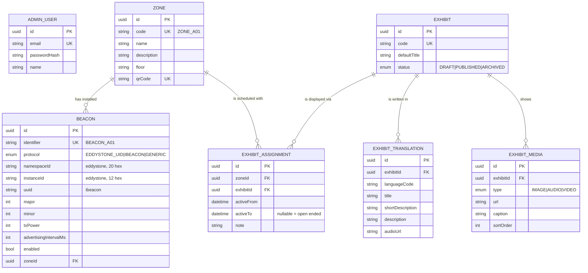

# Database

PostgreSQL, accessed through Prisma. Schema: [`apps/api/prisma/schema.prisma`](../apps/api/prisma/schema.prisma).

## 1. Entity relationships



## 2. Table notes

### `zones`
`code` is the permanent public identifier printed inside the QR payload
(`<VISITOR_WEB_URL>/q/<code>`). It is unique and never reused. A zone can only be
deleted once no beacon points at it; its schedule entries cascade.

### `beacons`
`identifier` is the logical name the mobile app reports to the API — deliberately
independent of the manufacturer protocol.

Identity comes from what the beacon **broadcasts**:

- `namespaceId` + `instanceId` — Eddystone UID, the primary identity. Carried in
  BLE service data `0xFEAA`, which Android and iOS both expose to a normal scan.
- `uuid` + `major` + `minor` — iBeacon, secondary. The same physical unit can
  advertise both, and this is the identity iOS Core Location would monitor for
  background region entry.

Both pairs carry a composite unique constraint, so two records cannot claim the
same hardware. The backend refuses to save a beacon that carries no readable
identity for its protocol.

**There is no MAC address column, on purpose.** Android reports a stable MAC as
the BLE device id while iOS reports a per-installation UUID, so a MAC can never
identify the same beacon across platforms.

`txPower` and `advertisingIntervalMs` record what the beacon was actually
configured to — they are calibration facts a future colleague needs, not
decoration. `enabled = false` makes the public endpoint answer `BEACON_DISABLED`
instead of resolving content, which is how staff take a faulty beacon out of
service without deleting configuration.

### `exhibits`
Language neutral. `defaultTitle` is an internal CMS label and the last-resort
fallback; visitors are always served an `ExhibitTranslation`. Only `PUBLISHED`
exhibits ever reach a visitor — the public resolver treats a scheduled `DRAFT`
exactly like an empty zone.

### `exhibit_translations`
Unique on `(exhibitId, languageCode)`. Codes are ISO-style: `vi`, `en`, `ja`,
`ko`, `zh`, `fr`, optionally with a region suffix (`zh-Hans`, `pt-BR`).
**Adding a language is inserting a row** — never a schema change.

Selection order (`pickTranslation`, unit tested):

1. exact match on the requested code
2. the base language of a regional code (`pt-BR` → `pt`)
3. the museum's configured `DEFAULT_LANGUAGE`
4. the first translation that exists

When the served language differs from the requested one, the response sets
`translationFallback: true` so the UI can say so instead of silently lying.

### `exhibit_media`
Language-neutral gallery. Narration that *is* language specific lives in
`ExhibitTranslation.audioUrl`. URLs are stored relative (`/uploads/audio/x.wav`)
and expanded to absolute by `ExhibitContentService` using `PUBLIC_BASE_URL`, so
moving the API to another host does not require a data migration.

### `exhibit_assignments` — the important one

> During `[activeFrom, activeTo)`, this exhibit is physically displayed in this zone.

Staff never see this table. The CMS asks one question — *what is in this room?* —
and the service maintains the rows underneath.

- Exactly one assignment per zone has `activeTo = NULL`: that is what is on
  display now.
- Setting a new exhibit **ends** the current row (`activeTo = now`) and opens a
  new one, so the record of what stood where survives.
- Intervals are **half open**: a row ending at `T` and the next starting at `T`
  do not overlap, and there is never an instant with two current exhibits.
- Different zones are completely independent.

```
ZONE_A01
 ├── EX_DONGSON_DRUM    01 Jan 2026 ──────────► 01 Jul 2026   (history)
 └── EX_CHAM_STATUE                             01 Jul 2026 ──────────► open  (current)
```

The decision itself is a pure function, `planCurrentExhibitChange()`:

| Situation | What happens |
| --- | --- |
| Zone is empty | create an open-ended assignment |
| A different exhibit is current | close the current row, open a new one |
| The same exhibit is already current | no write at all |
| A row exists that never went on display | delete it |
| A row was created in this same instant | delete rather than close it (no zero-length intervals) |
| Clearing the zone | close the current row, create nothing |

`ScheduleConflictValidator` is still there as the invariant guard: after any
write it asserts that the zone resolves to exactly **one** exhibit, catching data
that arrived some other way (a manual SQL edit, a restored dump).

## 3. Why time lives on the join

Putting `zoneId` on `Exhibit` would make the relationship permanent and single
valued, and it would throw away the past every time an exhibition changed.
Keeping it on a join table with a validity period gives, for free:

- rotation without touching hardware or reprinting QR codes
- a complete history of what stood where, without a second audit table
- one rule — `activeFrom <= at < activeTo` — shared by BLE, QR and the CMS
- `?at=<ISO timestamp>` on every public endpoint, so you can ask what a beacon
  resolved to last month

The cost is one join. The staff-facing complexity is zero, because the CMS only
ever asks "what is in this room?".

## 4. Seed data

`npm run db:seed` builds its dates from *today*, so the demo is always live:

| Zone | Beacon (Eddystone instance) | Exhibit | Period |
| --- | --- | --- | --- |
| `ZONE_A01` Ancient Sculpture | `BEACON_A01` · `…0001` | `EX_DONGSON_DRUM` | start of year → last month *(history)* |
| `ZONE_A01` | — | `EX_CHAM_STATUE` | last month → open ended *(current)* |
| `ZONE_A02` Traditional Painting | `BEACON_A02` · `…0002` | `EX_HANG_TRONG_PAINTING` | start of year → open ended |
| `ZONE_B01` Modern Art | `BEACON_B01` · `…0003` | `EX_MODERN_LACQUER` | last month → open ended |

All three beacons are seeded as Minew i3 units: Eddystone namespace
`a1b2c3d4e5f607182930`, instances `000000000001`–`000000000003`, iBeacon UUID
`f7826da6-…` as a secondary identity, Tx power `-8 dBm`, advertising interval
`500 ms`.

Five exhibits are created: four `PUBLISHED` (Vietnamese + English, plus Japanese
on the Cham statue and French on the lacquer panel) and one `DRAFT`
(`EX_TEXTILE_DRAFT`) that exists purely to demonstrate that unpublished content
never reaches a visitor.

Placeholder narration (`.wav`) and images (`.svg`) ship in
`apps/api/prisma/seed-assets/` and are copied into `apps/api/uploads/` by the
seed, so the audio player has something real to play on a fresh clone.

## 5. Migrations

```bash
npm run db:migrate                                  # prisma migrate dev
npm --workspace apps/api run prisma:deploy          # prisma migrate deploy (CI/prod)
npm run db:reset                                    # drop + migrate + seed
```

Migrations are committed under `apps/api/prisma/migrations/`. Never edit an
applied migration — add a new one.
