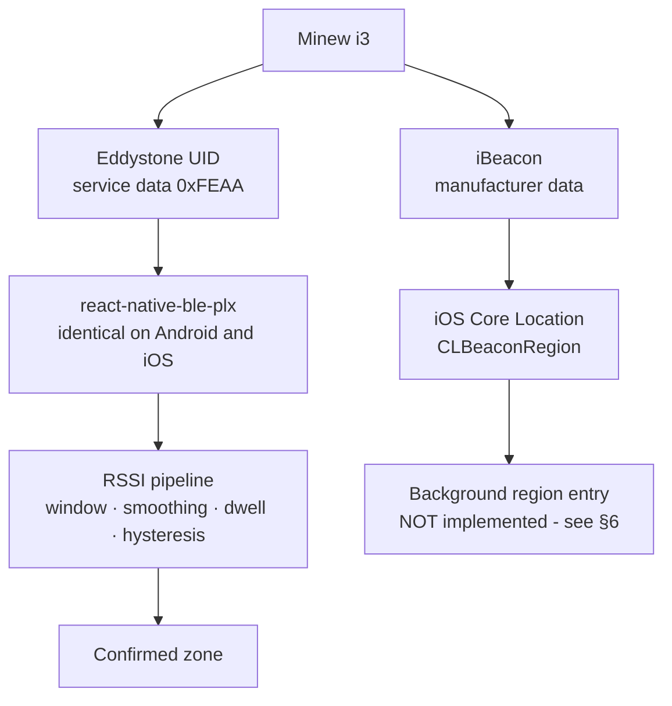

# Beacon hardware

Reference hardware for this project: **Minew i3 Robust Beacon** (Nordic nRF52,
Bluetooth LE 5.0, IP67, 2 × AA, configurable through the BeaconSET+ app).

Nothing in the codebase is Minew-specific. Identity is read from the advertised
payload and stored as `namespaceId` / `instanceId` (or a UUID triple), so
swapping vendors is a configuration change, not a rewrite.

---

## 1. Why this hardware fits

| The project needs | i3 |
| --- | --- |
| BLE advertisement a phone reads directly | BLE 5.0 |
| No gateway, no Wi-Fi, no pairing, no SIM | broadcast only |
| A stable per-beacon identity | Eddystone UID + iBeacon |
| RSSI for proximity | yes |
| **Configurable Tx power** | approx. −40 … +4 dBm |
| **Configurable advertising interval** | yes |
| Both protocols at once | yes |
| Fixed installation, replaceable battery | 3M / screws, 2 × AA |
| Survives a public building | IP67 |

The two entries in bold matter more than anything else on the list — see §4.

> Reseller listings and the manufacturer datasheet disagree on small details
> (IP66 vs IP67, weight with or without batteries, "5 years" vs "6 years"). None
> of it affects this project; trust the manufacturer datasheet.

---

## 2. Protocol choice: Eddystone UID is primary

The i3 can advertise **Eddystone UID and iBeacon simultaneously**, and this
project uses both — for different jobs.



**Why not iBeacon as the primary path.** Apple routes iBeacon frames through
Core Location rather than exposing them as ordinary BLE advertisements, so a
Core Bluetooth binding like `react-native-ble-plx` cannot be relied on to read
UUID/major/minor consistently on iOS. Android has no such restriction. Building
foreground detection on iBeacon means discovering the asymmetry late, on an
iPhone, after the architecture is set.

**Why Eddystone UID works.** Its payload lives in BLE *service data* under UUID
`0xFEAA`, which both platforms hand to a normal scan. `react-native-ble-plx`
exposes `serviceData`, `serviceUUIDs` and `rssi`, which is exactly what the
pipeline needs — and the same code path runs on both platforms.

**Never the MAC address.** Android reports a stable MAC as the device id; iOS
reports a per-installation UUID. A MAC cannot identify the same beacon across
platforms, so it is not stored and not matched on.

---

## 3. Identity scheme

One namespace for the museum, one instance per beacon:

```
Namespace (10 bytes / 20 hex)   a1b2c3d4e5f607182930

Instance (6 bytes / 12 hex)
  000000000001  →  BEACON_A01  →  ZONE_A01
  000000000002  →  BEACON_A02  →  ZONE_A02
  000000000003  →  BEACON_B01  →  ZONE_B01
```

The app builds a protocol-qualified `beaconId` and matches it against the
registry downloaded from `GET /api/public/beacons`:

```
eddystone_uid   a1b2c3d4e5f607182930:000000000002
ibeacon         f7826da6-4fa2-4e98-8024-bc5b71e0893e:1:2
```

Both map to the same `Beacon` row, so one physical unit advertising both frames
is recognised either way.

Fill in the iBeacon UUID/major/minor as well even when using Eddystone: it costs
nothing, and it is the identity the iOS background path would need later.

---

## 4. Configuration with BeaconSET+

Per beacon, set:

| Setting | Prototype value | Why |
| --- | --- | --- |
| Eddystone UID namespace | `a1b2c3d4e5f607182930` | same for the whole museum |
| Eddystone UID instance | `000000000001` … | one per beacon |
| iBeacon UUID | one museum UUID | secondary identity |
| iBeacon major / minor | `1` / `1,2,3` | secondary identity |
| **Tx power** | **−8 dBm** | *not* +4 — see below |
| **Advertising interval** | **500 ms** | detection speed vs battery |

Then register the same values in the CMS under **Beacons ▸ New beacon**.

That dialog can also read them off the air: **Scan** lists beacons in range and
fills the identity fields on click. The staff phone is never involved, and the
visitor app carries no setup tooling.

The scan does not happen in the browser. Chrome's Web Bluetooth never surfaces
service data or manufacturer data on macOS — which is precisely where Eddystone
and iBeacon identities live — and `chrome://bluetooth-internals` shows the same
gap: an empty Manufacturer Data column for every device. So the API spawns a
small CoreBluetooth helper (`apps/api/tools/beacon-scan.swift`, built with
`npm run scanner:build`) that captures raw advertisements, and decodes them in
`advertisement.parser.ts`, which is unit tested against real i3 frames.

Two consequences worth knowing:

- The scan finds beacons in range of **the API host**, not of the browser. That
  is the same laptop during installation, and nothing at all once the API moves
  to a server — where the endpoint reports itself unavailable.
- macOS attributes Bluetooth permission to the app that launched the API, not to
  the helper. Allow it for that app under **System Settings ▸ Privacy & Security
  ▸ Bluetooth**, then restart the API from it.

Typing the values in by hand remains fully supported and is the guaranteed path.

### Turn the power DOWN

The i3 advertises a theoretical maximum range around 200 m. For museum zoning
that is a liability, not a feature. At full power a phone standing in room A
hears every beacon in the building at similar strength:

```
A  −61      B  −65      C  −69     ← unusable: no clear winner
```

What zone detection needs is a signal that is strong inside the room and falls
away sharply outside it:

```
        Zone A
   ┌───────────────┐
   │      📱       │      strong inside
   │       ●       │
   │    beacon     │      much weaker outside
   └───────────────┘
```

`−12 … −8 dBm` is a sensible starting point for a 3–5 m zone. Measure, then
adjust. For bench testing with all three beacons on one desk, drop them to
**−40 dBm** — the i3's lowest setting — so the near/far RSSI gap stays large
enough to tell the zones apart without walking anywhere.

### Zone reach, per beacon

Tx power shapes what the beacon *sends*; **Beacons ▸ Edit ▸ Zone reach** sets
what the phone still *accepts*. It is the minimum smoothed RSSI that counts as
"inside", stored per beacon and handed to the app in `GET /public/beacons`, so a
display case and a hall no longer have to share one threshold. Left unset, a
beacon follows the app's global `EXPO_PUBLIC_MIN_RSSI`.

It is stored in dBm, never metres. A radius would imply a precision that does
not survive a wall, a glass case, or a crowd — the same reason this project
smooths RSSI rather than trying to convert it to distance. Walk the zone and
adjust; §5 below is the procedure.

### Advertising interval

| Interval | Effect |
| --- | --- |
| ~100 ms | fastest detection, most battery drain |
| **~500 ms** | **good balance for an interactive guide** |
| 900 ms (i3 default) | fine for asset tracking, starves a 4 s RSSI window |
| >1000 ms | too few samples for smoothing to work with |

The app's sliding window is 4000 ms. At 500 ms that is ~8 samples per beacon per
window — enough for the median-based outlier filter to mean something. At 900 ms
it is ~4, which is thin.

---

## 5. Calibration procedure

Signal strength is not portable between buildings, phones, or crowd levels, so
there is no universal RSSI threshold. Measure it:

1. Set Tx power to −8 dBm and interval to 500 ms on all beacons.
2. Open the app, go to **Settings ▸ BLE simulator** (or **BLE status** in real
   mode) to read live *smoothed* RSSI.
3. Record the smoothed value at **1 m, 3 m, 5 m, at the room border, outside the
   room, and through a wall**.
4. The gap between "centre of the room" and "border" is roughly the
   `EXPO_PUBLIC_HYSTERESIS_DB` you need.
5. Set `EXPO_PUBLIC_MIN_RSSI` just below the weakest reading you still consider
   "inside the room".
6. Walk the route a visitor would take and raise `EXPO_PUBLIC_DWELL_TIME_MS`
   until nothing switches while merely passing through a doorway.

Repeat with a second phone model — the absolute numbers will differ.

Things that move the numbers: walls, glass cases, metal frames, the visitor's
own body, beacon mounting height and orientation, phone model, and how many
people are in the room.

---

## 6. Foreground vs background — an honest boundary

**Foreground (app open): implemented.** Eddystone UID scanning through
`react-native-ble-plx`, full RSSI pipeline, dwell and hysteresis as documented
in [`ble-detection.md`](ble-detection.md).

**Background (app closed / phone locked): not implemented.** iOS throttles
background BLE scanning — duplicate discoveries are coalesced and the scan
interval stretches — which makes a 4 s window and a 3 s dwell timer meaningless.
The dependable route is Core Location region monitoring on a `CLBeaconRegion`,
which wakes the app on region entry. That is why the iBeacon frame is worth
configuring even in an Eddystone-first deployment.

`react-native-ble-plx` is a Core Bluetooth binding and cannot do this. It needs a
small native module around `CLLocationManager.startMonitoring(for:)`. The seam
exists in the codebase — `src/features/ble/ios-region-monitor.ts` defines
`BeaconRegionMonitor`, derives the regions from the registry, and ships an
`UnavailableRegionMonitor` that reports the capability as absent. The file also
lists exactly what the native module would need. Nothing pretends to work.

---

## 7. How many to buy

**Three.** Three beacons exercise every hard case:

```
  BEACON_A01     BEACON_A02     BEACON_B01
       ↘             ↓             ↙
                    📱
```

- overlapping coverage between adjacent zones
- RSSI noise and outlier spikes
- an A → B transition with dwell and hysteresis
- a third beacon that must be correctly *ignored*
- changing the exhibit in a zone without touching hardware

If three work, scaling to N zones is configuration — same firmware settings, one
more row in the CMS, one more instance ID. The architecture does not change.

---

## 8. Registering a beacon in the CMS

1. **Beacons ▸ New beacon**
2. `identifier` — `BEACON_A01` (the logical name the API resolves on)
3. `name` — something physical: "Minew i3 — Gallery A01"
4. Zone — the room it is screwed to
5. Protocol — **Eddystone UID**
6. Namespace + instance — exactly what BeaconSET+ shows
7. Optionally the iBeacon UUID/major/minor from the same unit
8. Tx power and interval — record what you configured, so the next person knows

The mobile app reloads the registry on startup, so a newly registered beacon is
recognised after a restart.
